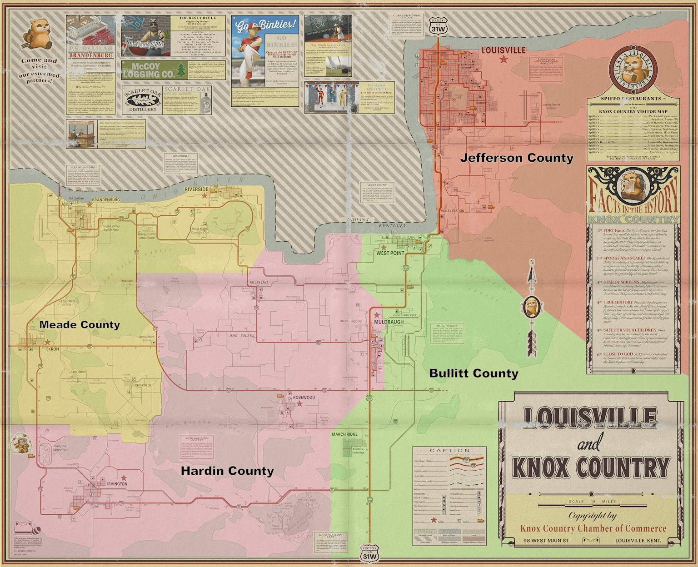

# Project Zomboid: A Comprehensive Deep Dive
## Overview
Project Zomboid is an open-world, isometric zombie survival RPG developed by the independent British-Canadian studio **The Indie Stone**[^1]. Set in the fictional Knox Country (loosely based on rural Kentucky) in 1993, the game puts players in the middle of the "Knox Event" — a zombie outbreak that the U.S. military has sealed off from the rest of the world[^2]. The game's core tagline is blunt and memorable: *"This is how you died."* Death is permanent by default, the world is indifferent, and the question isn't whether you'll survive forever — it's how long you'll last and what kind of story you'll tell before the end[^3].

Project Zomboid holds a **94% "Very Positive"** rating on Steam across over 447,000 user reviews and has sold an estimated **11–16 million copies**, generating an estimated $120–175 million in gross revenue[^4][^5][^6]. As of May 2026, it consistently attracts 20,000–30,000 concurrent players daily[^7].

***
## Development History
### Origins: 2009–2011
The game's origin story is practically a survival tale itself. Around 2009, developers **Chris Simpson** (known as "Lemmy") and **Andy Hodgetts** (known as "Binky") began designing an isometric zombie survival sandbox with deep RPG roots, drawing inspiration from *Resident Evil*, *Fallout*, and zombie fiction like *World War Z*[^8][^9]. The core vision was ambitious: a simulation where depression, starvation, and trust issues were just as deadly as zombies[^10]. Facing imminent eviction from their flat in Hartlepool, the team rushed a pre-alpha tech demo to generate income — working through the night in shifts just to make rent[^9].

The game first appeared on the Desura alpha-funding platform in 2011, making it one of the first five games on that platform[^2]. Early sales gave the team enough momentum to keep developing, but disaster struck almost immediately.
### The Incident: 2011
In October 2011, the Newcastle flat shared by Simpson and Hodgetts was **burglarized**. Two laptops containing months of unbacked code — including a nearly-complete update — were stolen[^11][^12]. Because the team had relied entirely on local machine-to-machine backups rather than external storage, the progress was irrecoverable[^13]. Making matters worse, PayPal had previously frozen the studio's funds over suspected fraud (related to an influx of early sales), and the game had already suffered from piracy of its web demo[^14].

Simpson's emotionally raw tweets in the immediate aftermath polarized the community. Some fans accused the team of fabricating the theft to cover development delays; others donated a second time out of sympathy[^14]. Writer Will Porter posted a formal apology on the Project Zomboid blog, and Simpson temporarily deactivated his Twitter account to recover[^13][^14]. The team rebuilt from older backups, implemented rigorous off-site backup protocols, and — critically — did not give up[^14]. The incident became infamous in indie game history as a cautionary tale that helped mainstream the concept of cloud backups among indie developers[^13].
### Steam Early Access: 2013–Present
Project Zomboid launched on **Steam Early Access on November 8, 2013**, priced at $19.99[^7][^15]. It has remained there ever since, making it one of the longest-running Early Access games on Steam[^16]. The development pace has been slow but deliberate — The Indie Stone subscribes to a philosophy of releasing massive, transformative updates rather than incremental patches. This approach has drawn both deep loyalty and intense frustration from the community[^17].

| Build | Year | Key Features |
|-------|------|-------------|
| Early Builds (pre-41) | 2013–2021 | Core looting/survival loop, farming, basic multiplayer (later removed), map expansion |
| Build 41 | December 2021 | Full combat/animation overhaul, new character models, revamped multiplayer, Louisville city added |
| Build 42 (Unstable) | December 2024 | Crafting overhaul, animals, verticality (32-floor support), basements, new map regions |
| Build 42 MP | December 2025 | Multiplayer support added to B42 Unstable branch |
| Build 42 (Stable) | TBD 2026 | Still in final testing as of May 2026 |

The release of **Build 41 on December 20, 2021** was transformational. It introduced a completely retooled multiplayer, updated 3D animations over the isometric engine, refined character customization, and added the massive city of Louisville[^15]. The build triggered a **23x spike in weekly sales**, briefly placing Project Zomboid at #4 on Steam's top-grossing charts — sandwiched between *Monster Hunter Rise* and a *Five Nights at Freddy's* title[^16]. Concurrent player counts exploded to an **all-time peak of 65,505 on January 2, 2022**[^4].

***
## Core Gameplay
### Survival Simulation Philosophy
Project Zomboid's defining philosophy is **selective realism** — it simulates enough of reality to create genuine tension without drowning the player in spreadsheet complexity[^18]. The game doesn't just ask "can you kill zombies?" It asks whether you can manage hunger, thirst, fatigue, boredom, depression, injuries, and illness simultaneously while the world slowly falls apart around you[^10][^18].

Specific examples of this depth include:
- **Wounds** require cleaning, bandaging, and monitoring for infection — a bitten scratch can be fatal days later
- **Food spoilage** is simulated per item, forcing players to prioritize fresh food and develop food preservation strategies
- **Utilities fail** — electricity and running water shut off after a randomized in-game period (usually 0–30 days), pushing players toward self-sufficiency
- **Psychological states** are tracked via "Moodles" — visible mood indicators for stress, fear, panic, boredom, and exhaustion that affect combat performance and decision-making
- **Sound propagates realistically** — every gunshot, shattered window, or car alarm can attract zombies from across the map[^18]
### Game Modes and Difficulty
The game offers four preset difficulty modes designed for different playstyles[^19]:

- **Survivor** — Balanced mode; focused on combat, zombies are manageable, loot is accessible
- **Builder** — Low-stress mode for base construction and farming; smaller, weaker hordes
- **Apocalypse** — The harshest preset; strong zombies, large hordes, scarce loot, player is highly vulnerable
- **Custom Sandbox** — Fully adjustable; players can tune zombie population, loot rarity, utility shutoff timing, infection severity, and dozens of other parameters

Additionally, fixed **Challenge Scenarios** present unique conditions like endless winter storms or a zombie horde that hunts the player after one in-game day[^15].
### Character Creation: Occupations and Traits
Before spawning, players design a character by choosing an **occupation** and selecting **positive and negative traits** using a point-buy system[^20]. Occupations grant starting skill bonuses and sometimes unique abilities. Key examples include:

| Occupation | Key Skills | Notable Ability |
|------------|-----------|----------------|
| Veteran | Aiming +2, Reloading +2 | "Desensitized" — never panics |
| Burglar | Lightfooted +2 | Can hotwire cars |
| Doctor | First Aid +3 | Enhanced medical treatment |
| Police Officer | Aiming +3, Reloading +2 | Effective with firearms |
| Carpenter | Carpentry +3 | Optimal base builder |
| Park Ranger | Foraging +2, Trapping +2 | Speed boost in forests; improved search mode |

Traits can amplify strengths or introduce meaningful weaknesses. Community-favored positive traits include **Fast Learner** (130% XP gain), **Organized** (30% more container capacity), **Strong**, and **Athletic**[^21]. Build 42 rebalanced many of these, making it harder for a single character to master all skills and pushing players toward specialization — which amplifies the importance of multiplayer cooperation[^21][^22].
### The Skill System
Project Zomboid features a deep skill tree across multiple categories — Combat (Blunt, Blade, Spear, Aiming, Reloading), Agility (Sprinting, Lightfooted, Nimble, Sneak), Crafting (Carpentry, Cooking, Farming, Tailoring, Mechanics, Electrical), and Survivalist (Foraging, Trapping, Fishing)[^20]. Skills improve through practice — you get better at sneaking by sneaking near zombies, better at carpentry by building, better at cooking by cooking. This creates a natural "learn by doing" progression that rewards players who commit to a style of play[^23].
### The Map: Knox Country

Louisville and Knox County map
The game world is a large, contiguous isometric map representing a fictionalized version of rural and suburban Kentucky[^24]. All regions are connected on a single world map, meaning a player starting in a small town can walk or drive to the massive city of Louisville. Key locations include:

- **Muldraugh** — Small starting town; good mix of residential and commercial loot; classic early-game spawn
- **West Point** — Dense urban area along a river; high zombie population, high reward
- **Rosewood** — Quieter suburban town; contains the Kentucky State Prison
- **Riverside** — Scenic riverside town; good for new players
- **Louisville** — The major metropolitan area; the most dangerous location on the map with the highest zombie density, but offers massive loot and exploration potential including skyscrapers, universities, hospitals, and more[^25]

Build 42 **significantly expanded the map** westward and northward, adding vast rural industrial parks, wilderness areas, new towns, and locations specifically designed to support long-term survival[^26][^27].
---
## Build 42: The Biggest Update in Zomboid History
Build 42, first released to the unstable branch on **December 17, 2024**, represents a fundamental shift in the game's design philosophy[^28]. Where Build 41 and earlier updates refined the survival loop around looting pre-existing supplies, Build 42 asks: *what happens when those supplies run out?* The developers have explicitly invoked the "Alexandria Years" from *The Walking Dead* — a post-crisis phase where survivors rebuild civilization rather than merely scavenge the ruins of the old one[^29][^27].
### Engine and Technical Overhaul
The engine itself was substantially overhauled[^26]:
- **Verticality**: The old 8-floor height limit is gone. Build 42 supports up to **32 floors**, enabling genuine skyscrapers and deep underground basements and bunkers
- **Lighting 2.0**: Light now behaves realistically, dipping into corners and reflecting off surfaces. Searching a dark basement with a flashlight is now a high-fidelity horror experience
- **Basement Mechanics**: Basements have independent acoustics — surface sounds are muffled, but noises inside echo further, creating new stealth and horror dynamics
- **Map Expansion**: Significant new territory added to the west and north[^27]
### Crafting Overhaul
Build 42 completely reworked the crafting UI to support sequential production chains[^29]. New post-apocalyptic professions include:

| New Profession | Primary Tool | Output |
|---------------|-------------|--------|
| Blacksmith | Bellows / Anvil | Hand-forged machetes, spears, tools |
| Potter | Kiln | Pottery, storage vessels |
| Brewer | Fermentation equipment | Alcohol, preservatives |
| Farmer (v2) | Expanded farming tools | Expanded crop varieties, livestock integration |
### Animal Husbandry and Hunting
Animals were entirely absent from the base game before Build 42. The update introduced **wild deer** (huntable), and domesticable livestock including **cows, chickens, and sheep**[^26]. Animals have genetic traits, enabling selective breeding for specialized livestock. This fundamentally changes the long-term food economy of the game, making renewable food sources viable without relying on loot respawn[^29][^26].
### Multiplayer Rollout Timeline
Build 42's multiplayer was not available at the December 2024 release — it arrived in **Build 42.13 on December 11, 2025**, described by the developers as a "stress test" release[^30]. This staggered approach mirrors how Build 41 handled its own multiplayer integration. As of May 2026, Build 42 remains in the **unstable/beta branch** — the stable default branch is still Build 41.78.16[^31]. The game's new design director, Christian Allen, stated in February 2026 that the team is "in the final charge of B42 unstable" with bug fixes, balancing, and polish still underway, but declined to give a specific stable release date[^22].

***
## Multiplayer
Project Zomboid supports both cooperative and competitive multiplayer, accessible through three methods[^32]:

1. **Steam Co-op Session** — One player hosts directly through the in-game "Host" menu. Easy setup, no financial cost. The server is only active while the host is online. Best for 2–4 friends
2. **Locally Hosted Dedicated Server** — Players run a dedicated server on their own hardware using SteamCMD. Requires opening ports 16261 and 16262. Server runs independently of the host's game session
3. **Third-Party Server Hosting** — Commercial server hosting providers (BisectHosting, Nitrado, etc.) offer managed servers with technical support

The Build 41 multiplayer implementation (by General Arcade) allows up to dozens of players on a single server and supports extensive mod loading. Large public servers commonly run curated modpacks via Steam Workshop collections[^33]. The absence of human NPCs means multiplayer effectively provides the "other survivors" element that singleplayer currently lacks — and The Indie Stone has acknowledged this explicitly in their roadmap communications[^34].

***
## The Modding Ecosystem
Project Zomboid has one of the most active modding communities in the survival genre. The **Steam Workshop** hosts thousands of mods ranging from quality-of-life tweaks to total conversion experiences[^35]. The Indie Stone maintains a permissive modding policy — players can edit the game in almost any way they choose, provided they don't circumvent the game's purchase requirement or produce objectionable content[^35].
### Categories of Popular Mods
- **Map Expansions** — Custom towns, cities, and regions that connect seamlessly to the base Knox Country map
- **Weapons & Arsenal** — Popular mods like Arsenal GunFighter significantly expand the firearms system with realistic gunplay
- **Realism/Immersion** — Mods adding water piping systems, more detailed food mechanics, NPC-like behaviors
- **Quality of Life** — Interface improvements, better item information displays, extended hotkeys
- **Overhaul Packs** — Curated modpack collections like "Project Sophie" (ranked as the 3rd most popular Zomboid collection of all time on Steam Workshop with over 100,000 impressions)[^36]

The modding community has become so integral that The Indie Stone frequently references modders in their build announcements, noting that the new crafting systems in Build 42 are specifically designed to be a "solid foundation for modders to run wild with"[^27].

***
## Commercial Performance and Player Metrics
### Sales and Revenue
| Metric | Figure |
|--------|--------|
| Estimated copies sold | 11.2M–15.7M[^6] |
| Estimated gross Steam revenue | $120M–$175M[^5][^6] |
| Steam reviews | 447,000+ (94% positive)[^4] |
| Steam followers | 587,587[^4] |
| Current Steam price | $19.99[^7] |

A Reddit calculation using the conservative figure of 9 million copies at a historical average sale price of ~$8.99 yields a minimum of ~$80.9 million in gross revenue, with ~$56.6 million reaching The Indie Stone after Steam's 30% cut — roughly $5.1 million per year averaged over 11 years[^37]. Estimates from Steam analytics tools place the total higher, in the $125M–$175M range after Steam's cut[^6].

The single biggest sales catalyst was **Build 41's multiplayer release in December 2021**, which produced a 23x spike in weekly sales[^16]. Sales historically spike every January as holiday gifters begin playing and word-of-mouth amplifies.
### Player Count Trends (Monthly Averages)
| Month | Average Players | Peak Players |
|-------|----------------|-------------|
| January 2026 | 34,056 | 58,382 [^7] |
| December 2025 | 30,254 | 57,886 [^7] |
| November 2025 | 21,812 | 37,002 [^7] |
| October 2025 | 22,875 | 38,860 [^7] |
| March 2025 | 23,464 | 37,897 [^7] |
| January 2025 | 36,757 | 57,616 [^7] |
| All-Time Peak | — | 65,505 (Jan 2, 2022) [^4] |

The December 2025 spike correlates with Build 42's multiplayer release, which drove renewed interest. The January spike is a consistent seasonal pattern.

***
## Community Reception: Praise and Criticism
### What Players Love
- **Systemic depth** — The interlocking simulation systems create emergent storytelling that no scripted game can replicate[^3]
- **Replayability** — Custom sandbox settings, different map regions, character builds, and the randomness of each run ensure near-infinite variety[^18]
- **Modding** — The active Workshop community effectively extends the game indefinitely[^36]
- **Multiplayer** — Playing with friends transforms the experience, as specialization in skills becomes genuinely valuable[^21]
- **Value** — At $19.99, a game that routinely generates 500–2,000+ hours of play is exceptional value by any metric[^38]
### Persistent Criticisms
- **Slow development pace** — The Indie Stone's build-level update approach means years pass between major changes. Build 42 took roughly three years from Build 41's release, and NPCs (promised since the early roadmap) remain unreleased as of 2026[^39][^17]
- **Extended Early Access** — The game has been in Early Access since 2013 — over 12 years as of 2026. Critics argue no game should take this long to leave Early Access[^16][^17]
- **No human NPCs** — This was promised for Build 43 in the 2022 roadmap but remains distant. The game world feels static without friendly or hostile human characters[^39][^40]
- **Communication gaps** — Players have noted that the team doesn't communicate consistently between major updates, creating uncertainty and frustration[^22]
- **Unstable Build 42** — Over a year after its beta release, Build 42 remains on the unstable branch, with saves, mods, and servers at risk of being disrupted by ongoing patches[^22]

***
## The Road Ahead: Build 43 and NPCs
The most anticipated feature in Project Zomboid's history is **human NPCs**. The 2022 official roadmap designated Build 43 as the NPC update, with plans for a Rimworld-like priority and jobs system, personality systems, procedural storytelling, and vehicle-driving NPCs[^39]. The Indie Stone even released an internal proof-of-concept video of NPC tech — featuring recognizable survivor characters navigating the world — though they noted it wasn't necessarily representative of the final implementation[^34].

As of early 2026, Build 43 is not yet in active public development — Build 42 itself has not reached stable status[^41]. The community generally accepts that NPCs are still years away, though Build 42's crafting and animal systems are understood to be laying important groundwork for the social and economic systems NPCs will require[^41][^22]. Design director Christian Allen's February 2026 communication suggested a renewed commitment to community transparency and faster iteration toward Build 42 stable, which would clear the path toward Build 43[^22].

***
## Game Design Analysis
Project Zomboid occupies a rare design space: it is simultaneously a **hardcore simulation**, a **deeply moddable sandbox**, and an **accessible multiplayer experience**. Its isometric perspective and retro-adjacent aesthetic belie extraordinary mechanical depth. The game's greatest design strength is how it uses **cumulative consequence** — no single mistake is usually fatal, but bad decisions compound until a situation becomes unrecoverable. A player who is sloppy about noise discipline, wound care, and food inventory for ten in-game days tends to be dead by day twelve[^18][^3].

The "Knox Event" narrative framing through radio broadcasts, TV channels, and environmental details rather than cutscenes or dialogue trees is a masterclass in **environmental storytelling**[^3]. Players piece together the apocalypse through snippets — a broadcaster going silent, a TV announcer's increasing panic, an abandoned note in a farmhouse — rather than having it explained to them. Once utilities shut off, the broadcast stops entirely, leaving only silence and static[^2][^1].

The decision to permanently set the game in **1993** (pre-cell phone, pre-internet, pre-modern vehicle diagnostics) is also thoughtful design. It constrains the player's information access in a way that feels organic rather than arbitrary, and it explains why society has no institutional response mechanism beyond the military cordon[^19][^2].

***
## Quick-Reference Summary
| Category | Details |
|----------|---------|
| Developer | The Indie Stone (UK/Canada) |
| Release (Early Access) | November 8, 2013 [^7] |
| Current Version | Build 41 (stable), Build 42 (unstable beta) [^31] |
| Platforms | Windows, macOS, Linux [^1] |
| Price | $19.99 [^7] |
| Steam Rating | 94% Very Positive (447K+ reviews) [^4] |
| Est. Copies Sold | 11–16 million [^6] |
| All-Time Peak Players | 65,505 (Jan 2, 2022) [^4] |
| Current Players (May 2026) | ~20,000–30,000 concurrent [^7] |
| Multiplayer | Co-op / Dedicated Servers (up to dozens of players) |
| Modding | Steam Workshop; thousands of mods available [^42] |
| Setting | Knox Country, Kentucky, 1993 |
| Tagline | "This is how you died." |

---

## References

1. [Project Zomboid - Wikiwand](https://www.wikiwand.com/en/articles/Project_Zomboid) - Project Zomboid is an open-world, isometric video game developed by British and Canadian independent...

2. [Project Zomboid | Zombiepedia - Fandom](https://zombie.fandom.com/wiki/Project_Zomboid) - Project Zomboid is an an open-world, isometric video game developed by British and Canadian independ...

3. [PROJECT ZOMBOID: A STATE OF EROSION - PROC3SS](https://proc3ss.com/reviews/project-zomboid-as-close-as-it-gets) - For over a decade, Project Zomboid has cultivated one of the most demanding survival sandboxes in mo...

4. [Project Zomboid Steam Charts - SteamDB](https://steamdb.info/app/108600/charts/) - Steam player count for Project Zomboid is currently 17376 players live. Project Zomboid had an all-t...

5. [How many copies did Project Zomboid sell? — 2026 statistics](https://levvvel.com/project-zomboid-statistics/) - Now, looking at Project Zomboid statistics, the numbers speak volumes about its success. The introdu...

6. [Project Zomboid Revenue & Stats](https://steamscanner.vercel.app/game/108600) - Project Zomboid Steam analytics: Est. revenue: $214.6M • 30.8K playing now • 94% positive (447.4K re...

7. [Project Zomboid Steam Charts | Steambase](https://steambase.io/games/project-zomboid/steam-charts) - Project Zomboid has 30,567 concurrent Steam players in-game. Explore more Steam Charts, stats, and t...

8. [The Amazing History of Developing Project Zomboid and ...](https://splashgame.org/the-evolution-of-project-zomboids-development/) - For those who have followed Project Zomboid, it has undergone a significant transformation since ear...

9. [Special Report - Project Zomboid](https://www.pcgamer.com/special-report-project-zomboid/) - This article originally appeared in PC Gamer UK issue 231. Yesterday, a burglary at The Indie Stone ...

10. [Project Zomboid Reviews - Metacritic](https://www.metacritic.com/game/project-zomboid/) - Surviving isn’t just about blowing zombie’s heads off. Depression, starvation, trust issues, lonelin...

11. [The Indie Stone is burgled, loses code for latest Project Zomboid update](https://www.engadget.com/2011-10-16-the-indie-stone-is-burgled-loses-code-for-latest-project-zomboi.html) - The homebase of Project Zomboid developer The Indie Stone was broken into last night, and two comput...

12. [Subscribe](https://web.archive.org/web/20130318154543/http:/projectzomboid.com/blog/index.php/2011/10/project-zomboid-burglary-statement)

13. [Project Zomboid devs on The Incident: the theft and loss of two months of work](https://www.eurogamer.net/project-zomboid-devs-on-the-incident-the-theft-and-loss-of-two-months-of-work) - At a packed first session at this year's Rezzed event in Brighton, developer The Indie Stone discuss...

14. [Project Zomboid Controversies & Major Debates - Shapes, Inc](https://shapes.inc/fandom/project-zomboid/controversies) - An overview of the production hurdles, community backlash, and development disputes surrounding Proj...

15. [Project Zomboid - Wikipedia](https://en.wikipedia.org/wiki/Project_Zomboid)

16. [How Project Zomboid made.. 23x its normal sales numbers?!](https://newsletter.gamediscover.co/p/how-project-zomboid-made-23x-its) - In fact, it's all the way up at #4 in last week's Steam charts, sandwiched between Monster Hunter Ri...

17. [Project Zomboid user reviews - Metacritic](https://www.metacritic.com/game/project-zomboid/user-reviews/)

18. [Surviving the End of the World: A Game Design Analysis of Project Zomboid](https://zaydqazi.substack.com/p/surviving-the-end-of-the-world-a) - In a market brimming with zombie survival games, Project Zomboid rises above the rest with its focus...

19. [Project Zomboid Gameplay Explained](https://www.gamersdecide.com/articles/project-zomboid-gameplay-explained) - In this article, we explain the gameplay features of Project Zomboid.

20. [Strategies](https://projectzomboid.fandom.com/wiki/Profession) - Before you start a game, you’ll be greeted with spawn locations. Afterwards, you’ll have a page to s...

21. [Project Zomboid The Best Occupations and Traits](https://pzfans.com/project-zomboid-the-best-occupations-and-traits/)

22. [For Project Zomboid players, the year-long wait for a stable build is ...](https://www.pcgamesn.com/project-zomboid/build-42-stable-final-charge) - New Project Zomboid design director Christian Allen wants to talk to players more as The Indie Stone...

23. [Project Zomboid Explained: A guide for newer/less ...](https://steamcommunity.com/sharedfiles/filedetails/?id=483830305) - This Guide covers the basics of everything with a few important areas going in-depth. Walks you thro...

24. [Knox Country - Project Zomboid Wiki - Fandomprojectzomboid.fandom.com › wiki › Knox_Country](https://projectzomboid.fandom.com/wiki/Knox_Country) - Knox Country (formerly known as Knox County) is a partially fictional area where the events of Proje...

25. [Project Zomboid Map Guide - Knox Country](https://server.nitrado.net/en-US/guides/project-zomboid-map-guide-knox-country) - Project Zomboid Map Guide 🗺️ Knox Country 🧟 detailed guide ✓ all major locations and where to find t...

26. [Project Zomboid Build 42 Features & Release Tracker (2025)](https://supercraft.host/wiki/project-zomboid/build_42_features/) - Hytale Community Retention Blueprint: Events, Creator Tools, and Onboarding Loops Retention is not a...

27. [Upcoming Features: B42 - Project Zomboid](https://projectzomboid.com/blog/upcoming-features-b42/) - We’re always hard at work on our next Project Zomboid update, as you can see in our Thursdoid blog p...

28. [Build 42 Guide - What's New in Project Zomboid - Supercraft Host](https://supercraft.host/wiki/project-zomboid/build_42_news/) - Subnautica 2 enters Early Access on May 14, 2026. If you’ve played the original Subnautica or Subnau...

29. [Project Zomboid's new Build 42 update, 3 years in the ...](https://www.pcgamer.com/games/survival-crafting/project-zomboid-build-42-update-patch-notes-new-features/) - The 11-year-old zombie survival sandbox keeps getting better, and this one is a doozy.

30. [Unstable 42 MP Released - Project Zomboid](https://projectzomboid.com/blog/news/2025/12/unstable-42-mp-released/) - Unstable Build 42.13, which contains multiplayer support, has been released. Merry Christmas. Ho ho ...

31. [Project Zomboid Build 42 Release Date: What People Mean](https://pzfans.com/ProjectZomboidB42ReleaseDate/) - Project Zomboid Build 42 release date depends on what you mean: first playable, multiplayer, or stab...

32. [How To Host Multiplayer Servers For Project Zomboid - A Guide To Dedicated Servers & More!](https://www.youtube.com/watch?v=-12EW8vxwLA) - In this video, we take a look at 3 ways to play Project Zomboid in multiplayer. We’ll cover how to s...

33. [How to Add a Steam Workshop Collection to a Project Zomboid Server!](https://www.youtube.com/watch?v=wwUFMMWHfo0) - Learn How to Add a Steam Workshop Collection to a Project Zomboid Server!

Not our customer yet? Get...

34. [2022 and Beyond - Project Zomboid](https://projectzomboid.com/blog/news/2022/01/2022-and-beyond/) - However, NPCs will still, technically, be build 43. This is because we'll be running a second dev te...

35. [Modding Policy - Project Zomboid](https://projectzomboid.com/blog/modding-policy/) - Hello survivor! Here’s the modding policy for Project Zomboid. Long story short, you can make mods, ...

36. [Evolving Project Zomboid Modding with Deathstar, ...](https://www.bisecthosting.com/pt-br/blog/project-sophie-zomboid-modding-mod-community-rimworld-deathstar) - Project Sophie has played a vital role in building the Project Zomboid modding community. Here, we c...

37. [Anyone else feel frustration about how slow the development of this game is taking?](https://www.reddit.com/r/projectzomboid/comments/1hqrzlu/anyone_else_feel_frustration_about_how_slow_the/) - Anyone else feel frustration about how slow the development of this game is taking?

38. [Project Zomboid on Steam](https://store.steampowered.com/app/108600/Project_Zomboid/) - Project Zomboid is the ultimate in zombie survival. Alone or in MP: you loot, build, craft, fight, f...

39. [Project Zomboid 2022 Roadmap Details Rimworld-like Systems](https://www.gamespot.com/articles/project-zomboid-2022-roadmap-details-rimworld-like-systems/1100-6499440/) - Build 43 is where The Indie Stone plans to introduce NPCs, in whatever form that might take. The pos...

40. [Why Players Are Losing Interest In Project Zomboid](https://www.youtube.com/watch?v=s2_KNEIUEs8) - Project Zomboid has thousands of dedicated players, some with over 1,000 hours,  yet a good chunk of...

41. [What do you guys believe B43 will be about? : r/projectzomboid](https://www.reddit.com/r/projectzomboid/comments/1s7j053/what_do_you_guys_believe_b43_will_be_about/) - I think B43 will be the Human NPC update, it has to be. We already got animal npcs and the most popu...

42. [Project Zomboid - Steam Community](https://steamcommunity.com/app/108600/workshop/) - Project Zomboid - Project Zomboid is the ultimate in zombie survival. Alone or in MP: you loot, buil...

